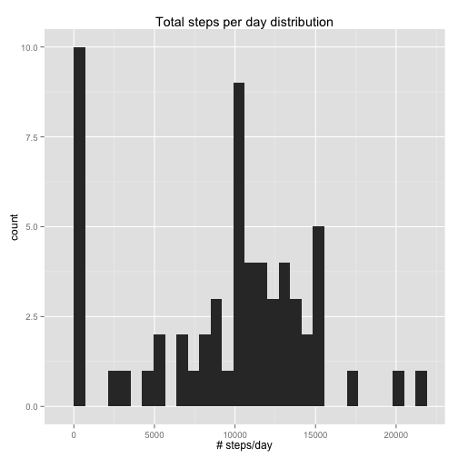
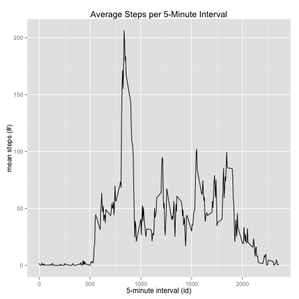
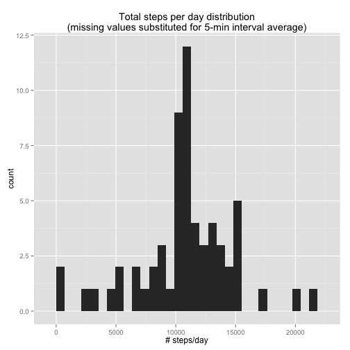
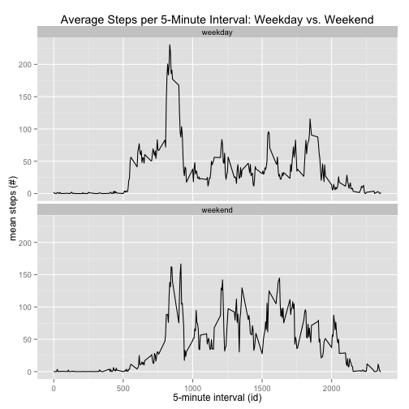

## Loading and preprocessing the data

First, unzip the data to a temporary dir and read the csv into R as a data frame called `activity`. Clean up the tempfiles when we're done with them.


```r
temp <- tempdir()
unzip('activity.zip', exdir = temp)
activity <- read.csv(file.path(temp, 'activity.csv'))
unlink(temp)
```

Load in `dplyr`, `lubridate` and `ggplot2` packages--we'll need them shortly (and throughout the rest of the analysis).


```r
library(lubridate)
library(dplyr)
library(ggplot2)
```

We will need more sophisticated date handling later in our analysis, so add column `parsed_date` that has `POSIXct` dates (via `lubridate::ymd`).


```r
activity <- mutate(activity, parsed_date = ymd(date))
```

Additionally, we need to know the weekday, so add a `weekday` column:


```r
activity <- mutate(activity, weekday = wday(parsed_date))
```

At this point, our dataset is ready to go. Here's the basic structure:


```r
str(activity)
```

```
## 'data.frame':	17568 obs. of  5 variables:
##  $ steps      : int  NA NA NA NA NA NA NA NA NA NA ...
##  $ date       : Factor w/ 61 levels "2012-10-01","2012-10-02",..: 1 1 1 1 1 1 1 1 1 1 ...
##  $ interval   : int  0 5 10 15 20 25 30 35 40 45 ...
##  $ parsed_date: POSIXct, format: "2012-10-01" "2012-10-01" ...
##  $ weekday    : num  2 2 2 2 2 2 2 2 2 2 ...
```

## What is mean total number of steps taken per day?

First, group the data by day, and use `dplyr`'s `summarize` function to get the total per day. Remove missing values when we call `sum`.


```r
steps_per_day <- activity %>%
    group_by(parsed_date) %>%
    summarize(total_steps = sum(steps, na.rm = TRUE))
```

Plot a histogram of steps per day.


```r
qplot(total_steps, data=steps_per_day, geom='histogram') +
    labs(title = 'Total steps per day distribution',
         x = '# steps/day')
```

 

Get the mean and median steps per day with `summary`.


```r
summary(steps_per_day$total_steps)
```

```
##    Min. 1st Qu.  Median    Mean 3rd Qu.    Max. 
##       0    6778   10400    9354   12810   21190
```

## What is the average daily activity pattern?

Group the data by the 5-minute interval, and calculate the mean of each interval's `steps` (averaging across all days). Remove missing values in the call to `mean`.


```r
interval_means <- activity %>%
    group_by(interval) %>%
    summarize(average_steps = mean(steps, na.rm = TRUE))
```

Next, plot a time-series graph of our summarized data.


```r
ggplot(data = interval_means,
      aes(x = interval, y = average_steps)) +
    geom_line() +
    labs(title = 'Average Steps per 5-Minute Interval',
         x = '5-minute interval (id)',
         y = 'mean steps (#)')
```

 

Next, calculate the interval with the maximum average steps by filtering down to the row that contains the maximum value for `average_steps`. The result is a one-row data frame with the interval id as the first column (`interval`) and its average step count (`average_steps`) as the second.


```r
filter(interval_means, average_steps == max(average_steps))
```

```
## Source: local data frame [1 x 2]
## 
##   interval average_steps
##      (int)         (dbl)
## 1      835      206.1698
```

## Inputing missing values

There are a number of missing values in the `steps` column:


```r
nrow(filter(activity, is.na(steps)))
```

```
## [1] 2304
```

This could introduce substantial bias into our analysis, so let's fill them in with the average across all days of that 5-minute interval--this way, we'll get a value that makes sense for that time of day. We already have the 5-minute interval averages in the data frame `interval_means`, so let's use that to fill in rows with missing values with the corresponding `interval`.

First, let's get `interval_means` in a more friendly format for quicker lookup--a named vector.


```r
interval_means_vec <- interval_means$average_steps
names(interval_means_vec) <- interval_means$interval
```

Now, use `dplyr`'s `rowwise` and `mutate` to produce a new data frame with the missing values filled in. (Note that the names for `interval_means_vec` have been coerced to class `character`, so we'll need to convert keys from `numeric` when we do our lookup in `mutate`.)


```r
na_inputted_activity <- activity %>%
    rowwise() %>%
    # convert from int to num, since our averages aren't integers
    mutate(steps = as.numeric(steps)) %>%
    # fill in missing values
    mutate(steps = ifelse(is.na(steps),
                          interval_means_vec[as.character(interval)],
                          steps)) %>%
    ungroup() # finally, ungroup rows from `rowwise` call
```

Let's confirm that it worked:


```r
nrow(filter(na_inputted_activity, is.na(steps)))
```

```
## [1] 0
```

To plot a histogram and calculate the mean and median of the new dataset, we need to group it by day and take the sum of `steps`.


```r
steps_per_day_na_inputted <- na_inputted_activity %>%
    group_by(parsed_date) %>%
    summarize(total_steps = sum(steps, na.rm = TRUE))
```

Plot a histogram of the grouped data:


```r
qplot(total_steps, data=steps_per_day_na_inputted, geom='histogram') +
    labs(title = 'Total steps per day distribution\n(missing values substituted for 5-min interval average)',
         x = '# steps/day')
```

 

Output summary statistics about `total_steps`, which includes the mean and the median:


```r
summary(steps_per_day_na_inputted$total_steps)
```

```
##    Min. 1st Qu.  Median    Mean 3rd Qu.    Max. 
##      41    9819   10770   10770   12810   21190
```

They are the same!

## Are there differences in activity patterns between weekdays and weekends?

Our dataset has weekdays in them (1-7, corresponding to Sunday through Saturday). Add a column with a two-level factor variable--either `'weekend'` or `'weekday'`.


```r
na_inputted_activity <- na_inputted_activity %>%
    mutate(type_of_day = as.factor(ifelse(weekday %in% c(1, 7),
                                          'weekend', 'weekday')))
```

Group data and take the mean, as we did earlier, except this time, also group by type of day.


```r
na_inputted_interval_means <- na_inputted_activity %>%
    group_by(interval, type_of_day) %>%
    summarize(average_steps = mean(steps))
```

Finally, create a two-panel plot plotting average steps per interval on weekends and weekdays.


```r
ggplot(data = na_inputted_interval_means,
      aes(x = interval, y = average_steps)) +
    facet_wrap(~type_of_day, nrow = 2, ncol = 1) +
    geom_line() +
    labs(title = 'Average Steps per 5-Minute Interval: Weekday vs. Weekend',
         x = '5-minute interval (id)',
         y = 'mean steps (#)')
```

 

